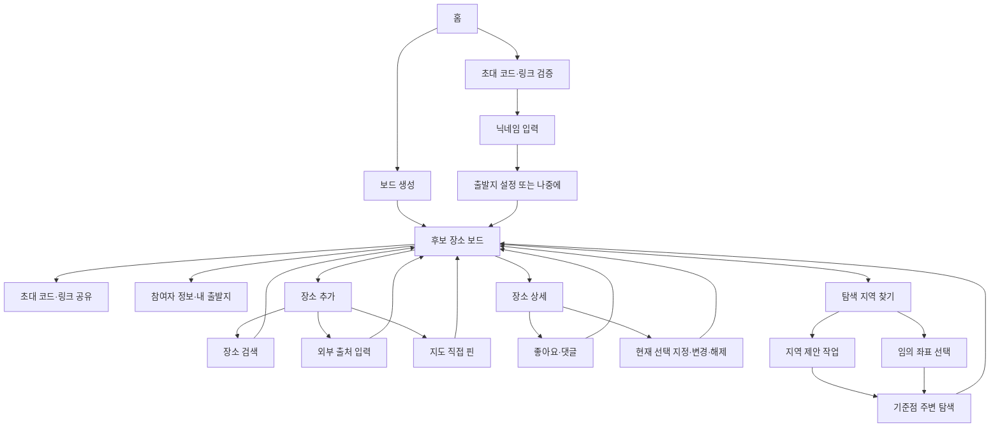

# 프론트엔드 1단계 현황 분석

작성일: 2026-07-24  
상태: 사용자 구조 선택 대기  
제품 기준: `docs/specs/기능명세서_v1.3.md`  
API 기준: `docs/specs/API명세서_v1.1.md`  
백엔드 보정 기준: `backend/docs/plan/12-phase7-canonical-alignment.md`

## 1. 결론

현재 프론트엔드는 최신 제품의 일부 핵심 소재를 포함하지만, 전체 사용자 흐름과 권한 모델은 이전 제품 정의에 묶여 있다. 기존 16개 화면 가운데 그대로 유지할 수 있는 제품 화면은 없다.

- 핵심 개념을 살려 전면 수정: 홈, 보드 생성, 후보 보드, 장소 검색·확인, 장소 상세, 지역 제안, 주변 탐색
- 새로 필요한 흐름: 초대 검증 후 닉네임 입장, 참여자 정보·출발지, 상시 초대 공유, 현재 선택 관리, 임의 좌표 주변 탐색
- 완전히 제거할 흐름: 투표, 코스, 번호 지도, 확정 일정, 출발 안내, 공개 공유, 운영 대시보드

가장 큰 문제는 시각적 완성도가 아니라 제품 계약의 불일치다.

1. 기존 구현은 개설자에게 실행·삭제·확정 권한을 주지만 최신 명세는 모든 참여자의 권한이 같다.
2. 기존 구현은 투표와 코스 확정을 중심으로 끝나지만 최신 제품에는 확정 절차가 없다.
3. 기존 지역 제안은 TMAP 평가 결과처럼 보이지만 최신 계약은 ODsay 도달권과 Kakao 기준점을 사용하는 탐색 보조 기능이다.
4. 기존 주변 탐색은 P1 코스 기능으로 표현되지만 최신 명세에서는 P0 후보 수집 경로다.
5. 현재 선택 장소의 지정·변경·해제와 마지막 변경자·시각 표시가 빠져 있다.

## 2. 조사 범위

### 프론트엔드

- `frontend/src/routes.jsx`
- `frontend/src/App.jsx`
- `frontend/src/pages/wireframe/ScreenIndex.jsx`
- `frontend/src/pages/wireframe/flowAB.jsx`
- `frontend/src/pages/wireframe/flowCD.jsx`
- `frontend/src/pages/wireframe/flowEF.jsx`
- `frontend/src/components/wireframe/Primitives.jsx`
- `frontend/src/index.css`
- `frontend/AGENTS.md`
- `frontend/package.json`

### 기준 문서

- `docs/specs/기능명세서_v1.3.md`
- `docs/specs/API명세서_v1.1.md`
- `backend/docs/plan/10-fe-contract-sync.md`
- `backend/docs/plan/12-phase7-canonical-alignment.md`

## 3. 현재 기술 상태

| 항목 | 현재 상태 | 판단 |
|---|---|---|
| UI 프레임워크 | React 19, JSX | 유지 |
| 개발 도구 | Vite 8 | 유지 |
| 스타일 | Tailwind CSS 4 | 유지 |
| 라우팅 | 브라우저 해시와 `useSyncExternalStore`를 이용한 자체 구현 | 목 흐름에는 충분하지만 동적 경로·중첩 화면·복원 상태 구현 전에 재검토 |
| API | axios 의존성만 있고 실제 공용 인스턴스는 없음 | 4단계에서 공용 클라이언트 구축 필요 |
| 테스트 | 테스트 러너 없음 | 이번 범위에서 임의 추가 금지, lint·build·브라우저 검증 사용 |
| 지도 | 플레이스홀더만 존재 | 3단계 목 구현에서는 지도 어댑터 경계를 만들고 실제 SDK는 승인 범위에 따라 적용 |
| 상태 | 모든 화면이 정적 JSX | 로딩·빈 화면·오류·선택·입력 상태가 없음 |
| 반응형 | 최대 400px 단일 열 | 모바일 와이어프레임 수준이며 데스크톱 지도·목록 분할 구조가 없음 |

현재 화면 목록 페이지와 프리미티브는 개발용 와이어프레임 도구다. 제품 컴포넌트로 승격하기보다 승인된 디자인에 맞춰 교체하는 편이 안전하다.

## 4. 기존 화면 분류

분류 기준:

- **유지**: 구조와 역할을 그대로 사용할 수 있음
- **수정**: 같은 사용자 목적을 유지하지만 내용과 상호작용을 다시 설계해야 함
- **통합**: 독립 페이지 대신 다른 흐름의 시트·모달·단계로 합치는 편이 적합함
- **삭제**: 최신 MVP 범위와 충돌함
- **신규**: 현재 구현에 대응 화면이 없음

### 4.1 기존 16개 화면

| 기존 화면 | 분류 | 최신 대응 | 분석 |
|---|---|---|---|
| PG-01 홈 | 수정 | 최신 PG-01 | 생성, 초대 코드·링크 입장, 최근 참여 보드는 유효하다. `COLLECTING`, `CONFIRMED` 분기와 확정 화면 연결은 제거해야 한다. |
| PG-02 보드 생성 | 수정 | 최신 PG-02 | 보드 이름·목적은 유지한다. 최신 생성 계약에 필요한 개설자 닉네임을 추가하고 명세에 없는 필수 후보 날짜와 생성 직후 장소 검색 분기는 제거한다. 생성 직후 초대 정보 확인이 필요하다. |
| PG-03 장소 검색 | 통합 | 최신 PG-06 | 검색 기능은 유지하되 후보 추가 흐름의 검색 탭 또는 단계로 통합한다. 결과 최대 5개 표기는 canonical 최대 15개 계약과 어긋난다. |
| PG-04 검색 결과 선택 | 통합 | 최신 PG-06 | 자동 등록 방지용 확인 단계는 유지한다. 별도 전체 페이지보다 검색 결과 상세·지도 확인 시트가 자연스럽다. 외부 출처와 직접 핀 경로도 같은 추가 흐름에 포함해야 한다. |
| PG-05 장소 보드 | 전면 수정 | 최신 PG-05, PG-08 일부 | 핵심 허브로 유지한다. 지도-카드 연동, 현재 선택 강조, 상시 초대 공유, 참여자 정보 진입, 좋아요, 빈 화면 행동을 추가해야 한다. 투표·코스 탭과 호스트 전용 삭제 규칙은 제거한다. |
| PG-06 장소 상세·댓글 | 수정 또는 통합 | 최신 PG-07, PG-08 일부 | 장소 정보·원본 지도·좋아요·댓글은 유지한다. 본인 댓글 삭제, 후보 삭제, 현재 선택 지정·변경·해제를 추가한다. 모바일에서는 바텀시트가 유력하다. |
| PG-07 만나기 좋은 지역 찾기 | 전면 수정 | 최신 PG-09 | 출발지 상태·30/45/60분 선택은 유지한다. 호스트 전용 실행, TMAP, 비용 중심 설명을 제거한다. 모든 참여자 실행, 비동기 진행·실패·재시도 상태가 필요하다. |
| PG-08 지역과 기존 장소 비교 | 전면 수정 또는 통합 | 최신 PG-09, PG-10 | ‘추천 순위’, 평균·최장시간·환승 점수, 기존 장소와의 우열 비교, 결정 CTA를 제거한다. 최대 1~3개 탐색 기준점과 빈 결과를 표현해야 한다. |
| PG-09 근처에서 더 찾기 | 전면 수정 | 최신 PG-10 | 최신 MVP에서는 P0다. 제안 기준점뿐 아니라 사용자가 지도 어디든 찍은 좌표를 중심으로 카테고리·키워드 탐색할 수 있어야 한다. 검색만으로 후보가 자동 생성되면 안 된다. |
| PG-10 투표·장소 결정 | 삭제 | 없음 | 정식 투표·마감·집계는 명시적 범위 제외다. 좋아요와 현재 선택으로 대체한다. |
| PG-11 코스 만들기 | 삭제 | 없음 | 다중 장소 코스 편집은 범위 제외다. |
| PG-12 번호 지도 | 삭제 | 없음 | 순서·경로·확정 개념은 범위 제외다. |
| PG-13 확정 일정 | 삭제 | 없음 | 장소·일정 확정 절차가 없다. |
| PG-14 내 출발 안내 | 삭제 | 없음 | 개인 출발 안내는 범위 제외다. |
| PG-15 약속 공유 페이지 | 삭제 | 없음 | 공개 공유 페이지는 범위 제외다. 참여자를 위한 초대 링크 공유만 남긴다. |
| PG-16 운영 대시보드 | 삭제 | 없음 | MVP 프론트엔드 범위 밖이다. |

### 4.2 분류 합계

| 분류 | 수 | 대상 |
|---|---:|---|
| 그대로 유지 | 0 | 없음 |
| 수정·전면 수정 | 6 | 홈, 생성, 보드, 상세, 지역 제안, 주변 탐색 |
| 통합 후보 | 3 | 장소 검색, 결과 확인, 지역 결과 |
| 삭제 | 7 | 투표부터 운영 대시보드까지 |

‘통합 후보’는 구조 대안 선택에 따라 독립 페이지로 남을 수 있다.

## 5. 신규 또는 명시적으로 보강해야 할 흐름

| 필요 기능 | 권장 표현 | 필수 상태 |
|---|---|---|
| 초대 링크·코드 검증 | `/join/:inviteCode` 진입 화면 | 확인 중, 유효, 만료·없는 코드, 닫힌 보드 |
| 닉네임 입력·참여 | 초대 진입 화면의 다음 단계 | 기본, 검증 오류, 제출 중, 참여 실패 |
| 개설자 닉네임 | 보드 생성 폼 | 기본, 검증 오류, 생성 중, 중복 제출 차단 |
| 초대 코드·링크 상시 확인 | 보드 헤더의 공유 시트 | 조회 중, 복사 성공·실패 |
| 참여자 정보 | 보드 헤더의 참여자 시트 | 목록 로딩, 출발지 등록·미등록, 내 정보 편집 |
| 본인 출발지 설정 | 참여자 시트 내부 편집 또는 전용 설정 화면 | 주소 검색, 결과 없음, 위치 선택, 저장 중·실패 |
| 현재 선택 장소 | 보드 강조 영역과 장소 상세 행동 | 선택 없음, 지정, 변경 확인, 해제, 동시 변경 반영 |
| 장소 추가 방식 선택 | 검색·외부 출처·직접 핀 탭 | 초기, 검색 중, 결과 없음, 후보 확인, 등록 중·실패 |
| 외부 출처 추가 | 장소 추가 흐름 내부 | 허용 링크, 금지 링크, 좌표 없음, 수동 보완 |
| 임의 좌표 주변 탐색 | 보드 지도 또는 탐색 화면 | 좌표 선택 전·후, 카테고리, 키워드, 결과 없음 |
| 지역 제안 작업 | 탐색 화면 | 준비 불가, 대기, 실행, 성공, 빈 결과, 실패, 429, 재시도 |
| 후보 삭제 | 상세 시트의 보조 행동 | 일반 삭제, 현재 선택 후보 삭제 시 자동 해제 안내 |

## 6. 최신 사용자 흐름



출발지 등록은 P0이지만 초대 입장 직후 반드시 막아야 한다는 명세는 없다. 따라서 첫 입장에서는 ‘지금 설정’과 ‘나중에’를 제공하고, 지역 제안 실행 시 미등록 상태를 명확히 해결하도록 유도하는 구성이 자연스럽다.

## 7. 정보 구조·라우트 대안

### 대안 A. 보드 중심 혼합형 — 권고

핵심 작업 공간인 후보 보드는 하나의 안정적인 URL로 유지하고, 짧고 맥락적인 작업은 바텀시트·모달로 처리한다. 지역 제안과 주변 탐색처럼 지도 상태와 비동기 작업이 길어지는 흐름만 별도 경로를 둔다.

#### 제안 라우트

```text
/
/boards/new
/join/:inviteCode
/boards/:boardId
/boards/:boardId/explore
```

#### 보드 내부 시트·모달

- 초대 코드·링크 공유
- 참여자 목록과 내 출발지
- 장소 추가: 검색·외부 출처·직접 핀
- 장소 상세: 좋아요·댓글·현재 선택·삭제
- 현재 선택 변경·해제 확인

#### 탐색 경로 내부 상태

- 지역 제안 준비·진행·결과
- 제안 기준점 선택
- 임의 좌표 선택
- 기준점 주변 카테고리·키워드 검색
- 검색 결과 후보 추가

#### 장점

- 사용자가 보드 맥락을 잃지 않는다.
- 모바일에서 지도 핀과 카드·상세 시트의 연결을 자연스럽게 표현할 수 있다.
- 핵심 경로 수가 적고 제품의 중심이 명확하다.
- 데스크톱에서는 같은 구조를 지도+패널 분할 레이아웃으로 확장하기 쉽다.

#### 단점

- 바텀시트의 브라우저 뒤로가기와 딥링크 규칙을 설계해야 한다.
- 한 보드 화면이 많은 상태를 관리하므로 컴포넌트와 상태 경계를 잘 나눠야 한다.
- 자체 해시 라우터를 유지한다면 오버레이 상태 복원이 복잡해질 수 있다.

### 대안 B. 명세 대응 독립 페이지형

기능명세서의 PG-01~PG-10을 거의 그대로 독립 URL로 만든다.

#### 제안 라우트

```text
/
/boards/new
/join/:inviteCode
/boards/:boardId/profile
/boards/:boardId
/boards/:boardId/places/new
/boards/:boardId/places/:placeId
/boards/:boardId/selection
/boards/:boardId/areas
/boards/:boardId/explore
```

#### 장점

- 명세와 화면의 1:1 추적이 쉽다.
- 각 화면의 로딩·오류 상태와 브라우저 뒤로가기가 단순하다.
- QA와 딥링크 검증이 쉽다.

#### 단점

- 짧은 작업마다 페이지가 전환되어 모바일 협업 보드의 연속성이 약해진다.
- 지도와 후보 목록의 맥락을 자주 잃는다.
- 초대 공유나 현재 선택처럼 작은 행동까지 별도 페이지가 되어 무겁게 느껴질 수 있다.
- ‘현재 선택’을 확정 절차처럼 오해하게 만들 위험이 있다.

### 대안 C. 단일 보드 워크스페이스형

홈·생성·입장을 제외한 모든 참여 후 기능을 `/boards/:boardId` 한 경로에 두고 지도 위 패널 모드로 전환한다.

#### 제안 라우트

```text
/
/boards/new
/join/:inviteCode
/boards/:boardId
```

보드 내부 모드는 `board`, `place`, `add`, `people`, `invite`, `area`, `nearby` 상태로 전환한다.

#### 장점

- 가장 앱다운 연속성과 빠른 상호작용을 제공한다.
- 지도 중심 경험이 강하다.
- 모바일 시트와 데스크톱 사이드 패널을 동일한 상태 모델로 표현할 수 있다.

#### 단점

- 새로고침, 딥링크, 뒤로가기, 모드 복원이 가장 어렵다.
- 현재 자체 해시 라우터와 정적 화면 구조에서 구현 위험이 크다.
- 한 화면의 상태 복잡도가 커져 목 구현과 API 연동 사이의 차이가 커질 수 있다.
- 교육·부트캠프 프로젝트에서 디버깅 비용이 가장 높다.

## 8. 대안 비교

| 평가 기준 | A. 보드 중심 혼합형 | B. 독립 페이지형 | C. 단일 워크스페이스형 |
|---|:---:|:---:|:---:|
| 모바일 흐름 연속성 | 높음 | 보통 | 매우 높음 |
| 지도-카드 연결 | 높음 | 보통 | 매우 높음 |
| 구현 복잡도 | 보통 | 낮음 | 높음 |
| 명세 추적성 | 높음 | 매우 높음 | 보통 |
| 뒤로가기·딥링크 | 보통 | 쉬움 | 어려움 |
| 반응형 확장 | 높음 | 보통 | 높음 |
| 현재 스택 적합성 | 높음 | 매우 높음 | 낮음 |
| 핵심 경험 집중도 | 매우 높음 | 보통 | 높음 |

## 9. 권고안

**대안 A, 보드 중심 혼합형을 권고한다.**

이 제품은 페이지를 많이 방문하는 정보 사이트가 아니라 같은 보드에서 후보를 모으고 비교하는 협업 도구다. 장소 카드 선택 시 상세가 지도 맥락 위에 열리고, 핀 선택 시 같은 상세 시트가 열리는 구조가 제품 가치에 가장 잘 맞는다.

다만 모든 기능을 단일 화면 상태로 밀어 넣지는 않는다. 지역 제안과 임의 좌표 주변 탐색은 지도 조작, 비동기 작업, 여러 결과 상태를 포함하므로 `/boards/:boardId/explore`라는 별도 경로로 분리한다. 이 절충으로 핵심 맥락을 유지하면서 상태 복잡도를 제한할 수 있다.

### 권고안의 화면 구성

1. 홈
2. 보드 생성
3. 초대 입장·닉네임
4. 후보 장소 보드
5. 탐색 지역·주변 장소 찾기
6. 개발용 화면 상태 카탈로그

독립 제품 화면은 5개지만 기능명세서 PG-01~PG-10의 모든 P0 기능을 시트·모달·내부 단계로 추적한다.

## 10. 보드 핵심 화면의 구조 원칙

디자인 에이전트에게는 다음을 고정 제약으로 전달한다.

### 모바일

- 상단: 보드 이름, 현재 선택 요약, 참여자·초대 진입
- 중심: 지도가 화면을 지배하지 않으면서 모든 후보 핀을 확인할 수 있는 영역
- 하단: 지도와 연결되는 스냅 가능한 후보 목록
- 주요 행동: ‘장소 추가’를 항상 쉽게 찾을 수 있게 유지
- 빈 상태: 장소 추가와 ‘어디서 찾을지 모르겠다면 지역 찾기’를 함께 제공
- 카드·핀 선택: 동일 장소를 같은 강조 색·상태로 연결
- 상세: 좋아요, 댓글, 현재 선택, 외부 지도, 삭제를 한 시트에서 제공하되 위험 행동은 분리

### 데스크톱

- 지도와 후보 패널을 좌우로 동시 표시
- 선택된 핀과 카드가 양쪽에서 동시에 강조
- 모바일 시트 내용을 우측 상세 패널로 전환
- 장소 추가와 탐색은 맥락을 유지하는 보조 패널 또는 모달 사용

## 11. 필수 화면 상태

### 공통

- 최초 로딩
- 부분 로딩
- 빈 화면
- 유효성 오류
- 네트워크 오류
- 재시도
- 권한·토큰 오류
- 찾을 수 없는 보드·장소

### 후보 보드

- 후보 없음
- 후보 있음
- 카드 또는 핀 포커스
- 현재 선택 없음
- 현재 선택 있음
- 현재 선택 변경 직후
- 다른 참여자의 변경 반영
- 선택된 후보 삭제 후 자동 해제

### 장소 추가

- 검색 전
- 검색 중
- 검색 결과 있음·없음
- 결과 선택·확인
- 외부 링크 허용·거부
- 직접 핀 선택 전·후
- 등록 중·성공·실패

### 지역 제안·주변 탐색

- 출발지 준비 완료·미완료
- 작업 대기·실행
- 성공 결과 1~3개
- 성공했지만 기준점 없음
- 공통 영역 없음
- 외부 API 실패·429
- 임의 좌표 선택
- 카테고리·키워드 검색 결과
- 후보 추가 전·후

## 12. 백엔드 계약이 디자인에 주는 제약

1. Kakao Local REST는 브라우저에서 직접 호출하지 않고 백엔드 검색 API를 사용한다.
2. 브라우저가 직접 쓰는 외부 지도 기능은 Kakao Maps JavaScript SDK다.
3. 참여 토큰은 보드 생성과 참여 응답에서만 내려오므로 성공 직후 저장 실패를 고려해야 한다.
4. 다른 참여자의 출발지는 상세 좌표·주소 없이 등록 여부만 표시한다.
5. 후보 목록은 `likeCount`, `likedByMe`, `selected`를 함께 받는다.
6. 현재 선택은 `selectedByParticipantId`, `selectedAt`을 표시할 수 있어야 한다.
7. 지역 제안은 비동기 작업이며 진행·실패·빈 성공 결과를 구분해야 한다.
8. 자유 좌표 주변 검색은 검색만으로 후보를 저장하지 않는다.
9. 모든 참여자가 후보 보관, 좋아요, 현재 선택, 지역 제안, 초대 정보 조회를 할 수 있다.
10. 레거시 Vote·Course·Departure API는 신규 MVP에서 노출되지 않는다.

`backend/docs/plan/10-fe-contract-sync.md` 일부는 과거 단계 설명을 포함하므로, 충돌 시 Phase 7 보정 문서와 최신 API 명세를 우선한다. 실제 API 연동 단계에서는 실행 중인 OpenAPI를 다시 검증해야 한다.

## 13. 1단계 승인 시 사용자가 선택할 항목

현재 선택할 것은 정보 구조 하나다.

- **A. 보드 중심 혼합형 — 권고**
- **B. 명세 대응 독립 페이지형**
- **C. 단일 보드 워크스페이스형**

선택 이후에는 해당 구조를 기준으로 Claude UI/UX Pro Max에 전달할 한국어 디자인 브리프를 작성한다. 색상·타이포그래피·분위기 같은 시각 방향은 다음 단계에서 디자인 에이전트가 2~3개로 제안하며, 이번 단계에서는 선택하지 않는다.

## 14. 1단계에서 변경하지 않은 항목

- `frontend/src` 제품 코드
- 현재 라우트
- 기존 와이어프레임
- 패키지 의존성
- 백엔드 코드와 계약 문서

이번 단계의 유일한 프로젝트 산출물은 이 분석 보고서다.
